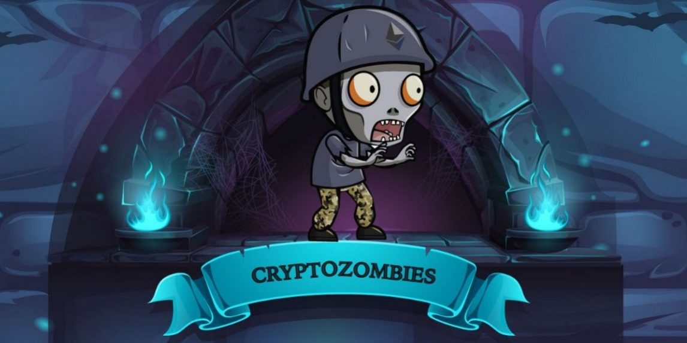

# CryptoZombies
Crypto Zombies is a course//course that helps people to learn solidity.
It's pretty interactive and has a nice touch to it.

I have done it together with a friend after already knowing some of solidity and got to know even more with it.

I super recommend you do it too.
https://cryptozombies.io/

## This repository
I'm using this repo only to keep track of how the contracts grown and increase between the lessons.
And as well as a away to compare and use as reference for contracts in the future.

